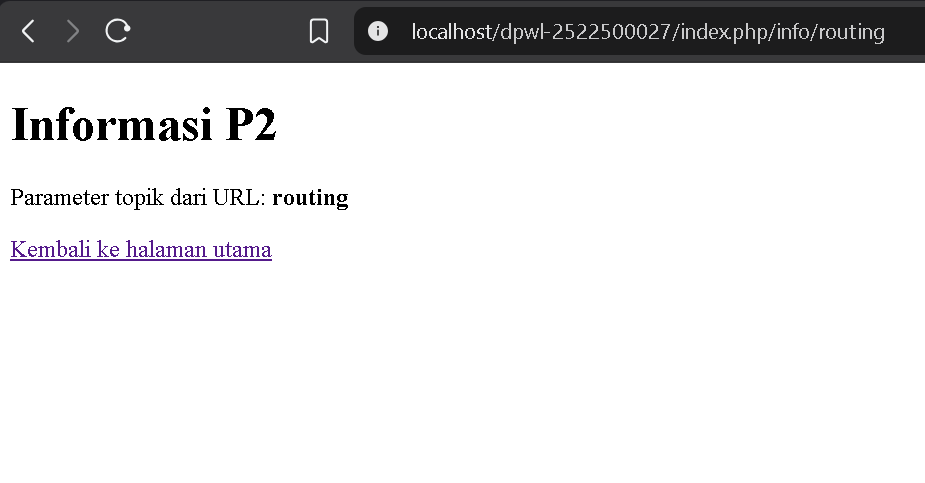
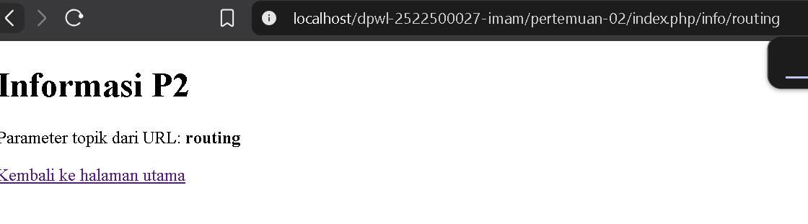
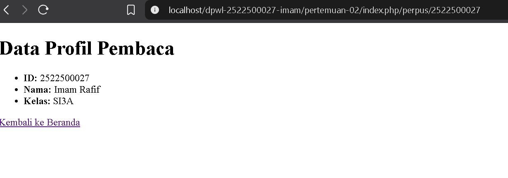

# pertemuan-02
# Laporan Praktikum Pertemuan 2 - PHP MVC Kustom

**NIM:** 2522500027
**Nama:** Al Imam Rafif Mukhlisin  
**Kelas:** SI3A  

---

## 1. Tujuan Praktikum
Memahami fondasi arsitektur PHP MVC kustom tanpa *framework*, serta mengimplementasikan *front controller*, pemetaan rute dinamis, dan penyajian data profil pemancing.

## 2. Struktur Direktori
```text
pertemuan-02/
├── application/
│   ├── config/          # Berkas pengaturan (routes.php, config.php)
│   ├── controllers/     # Alur logika (Home.php, Perpus.php)
│   ├── helpers/         # Fungsi pembantu URL (url_helper.php)
│   └── views/           # Tampilan antarmuka (home, perpus)
├── assets/
│   └── css/             # Berkas gaya tampilan (app.css)
├── dokumentasi/         # Tangkapan layar bukti uji (.png)
├── system/
│   └── core/            # Inti kerangka kerja (Controller.php, Router.php)
├── index.php            # Front Controller (pintu masuk utama)
└── README.md            # Berkas laporan praktikum
```
## 3. Front Controller
index.php berfungsi sebagai Front Controller yang menerima seluruh lalu lintas URL, memuat berkas konfigurasi, memanggil Router, serta mengeksekusi Controller yang dituju
## 4. Routing dan Pemetaan URL

Berikut adalah tabel pemetaan alur permintaan (*request*) dari URL ke Controller, Method, Parameter, hingga View yang dirender:

| URL/Route | Controller | Method | Parameter | View |
|---|---|---|---|---|
| `/` | Home | index | - | home/index.php |
| `home/index` | Home | index | - | home/index.php |
| `home/info/mvc` | Home | info | mvc | home/info.php |
| `info/routing` | Home | info | routing | home/info.php |
| `pemancing/1` | Pemancing | index | 1 | pemancing/index.php |

* **Penjelasan Route Modifikasi (`pemancing/1`):**  
  Ketika URL `pemancing/1` diakses, *Router* mengarahkan permintaan ke *Controller* `Pemancing` dan mengeksekusi *method* `index()`. Nilai `1` ditangkap sebagai parameter ID pemancing untuk menampilkan data spesifik pemancing pada *View* `pemancing/index.php`.
  5. Base URL dan Helperbase_url(): Membentuk alur URL statis menuju direktori aset.Contoh: <link rel="stylesheet" href="<?= base_url('assets/css/app.css'); ?>">site_url(): Membentuk URL rute internal aplikasi untuk navigasi.Contoh: <a href="<?= site_url('info/routing'); ?>">Info Routing</a>
  6. Alur Request-ResponseAlur Aktual P2:Browser $\rightarrow$ index.php $\rightarrow$ Router $\rightarrow$ Controller $\rightarrow$ View $\rightarrow$ Response.Posisi Model (MVC Utuh):Browser $\rightarrow$ index.php $\rightarrow$ Router $\rightarrow$ Controller $\rightarrow$ Model $\rightarrow$ Basis Data $\rightarrow$ Model $\rightarrow$ Controller $\rightarrow$ View $\rightarrow$ Response.Catatan: Komponen Model belum digunakan pada P2 karena pemrosesan basis data baru dipelajari di P3.
  7. Hasil Pengujian dan DebuggingSkenario Valid: Mengakses rute /, info/routing, dan pemancing/1 berhasil menampilkan data yang sesuai.Skenario Tidak Valid: Akses ke rute sembarang (misal home/xyz) menghasilkan respon error 404 Not Found.Proses Debugging:Gejala: Perubahan data profil pemancing tidak terbarui di browser.Penyebab: Berkas di editor VS Code belum disimpan (unsaved).Perbaikan: Menekan Ctrl + S untuk menyimpan berkas.Hasil Uji Ulang: Tampilan profil pemancing berhasil diperbarui.

  8. Gambar 1. Hasil Pengujian Halaman Utama


### Gambar 2. Hasil Pengujian Custom Route perpus


### Gambar 3. Hasil Pengujian Route Info


9. Kesimpulan P2
Praktikum P2 berhasil mengimplementasikan front controller, pemetaan rute dinamis, serta pemisahan logika (Pemancing.php) dan tampilan (view). Pengelolaan data melalui Model dan basis data akan dilanjutkan pada P3.